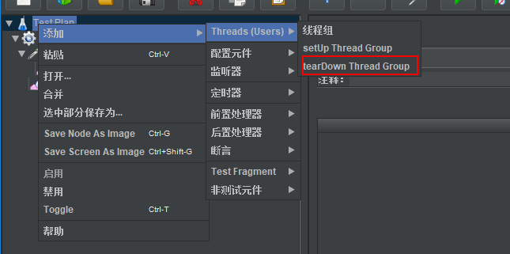
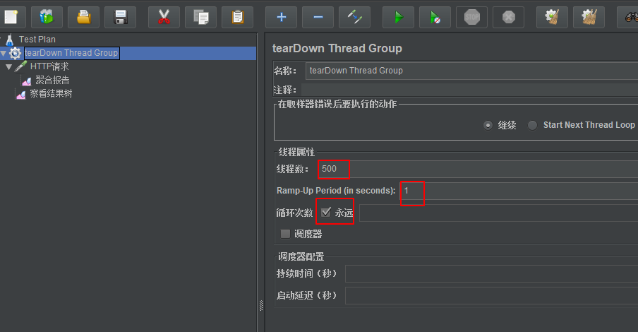
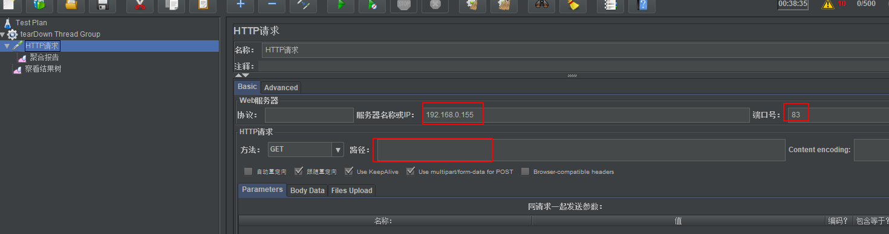
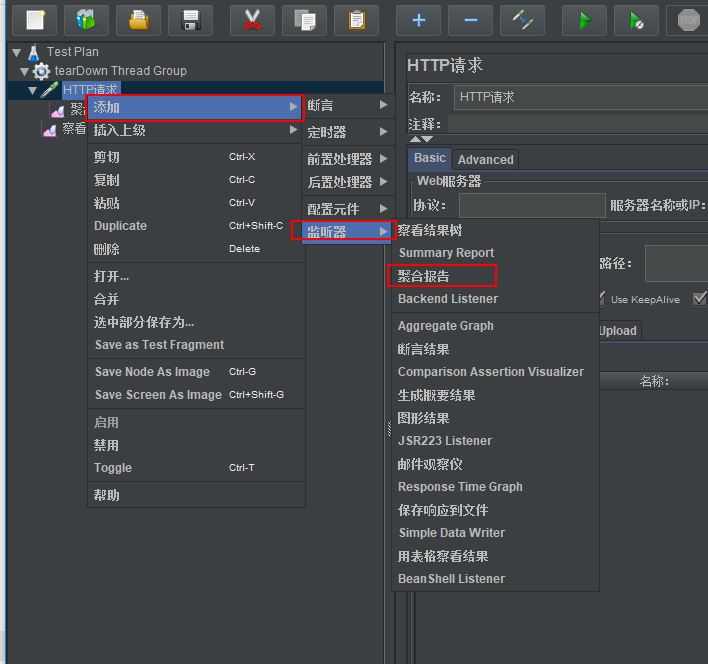

[TOC]

> [官方下载](https://jmeter.apache.org/download_jmeter.cgi)

## 安装
1. 官方
[官方下载](https://jmeter.apache.org/download_jmeter.cgi)

2. choco 安装
`choco install jmeter`

## 启动
打开`jmeter.bat` 文件,可能需要现在安装Java

## 设置中文
`options > choose language > chinese `

## 开始

