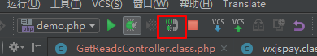
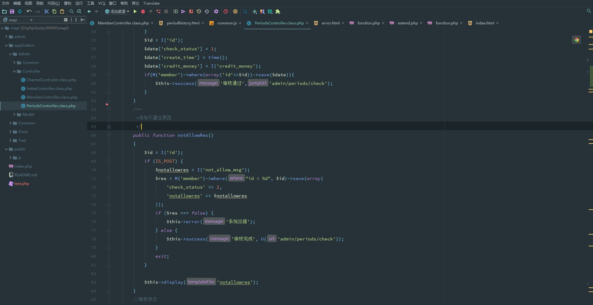

# PHPStorm
[TOC]

## 激活地址
新教程[教程地址](http://www.imsxm.com/jetbrains-license-server.html)
## 汉化和配置
汉化替换lib下文件
文件在oneDrive
## mac 卡顿设置

## 连接Mysql
>view->工具窗口->database
>若无法下载驱动,在XML文件中mysql的地址:[下载](http://download.jetbrains.com/idea/jdbc-drivers/mysql-connector-java-5.1.35-bin.jar)

## 开启phpstorm调试模式

1. 开启phpdebug

		xdebug.profiler_output_dir="D:\phpStudy\tmp\xdebug"
		xdebug.trace_output_dir="D:\phpStudy\tmp\xdebug"
		zend_extension="D:\phpStudy\php\php-5.4.45\ext\php_xdebug.dll"   写自己的文件路径
		xdebug.remote_enable = On
		xdebug.remote_handler = dbgp
		xdebug.remote_host= localhost
		xdebug.remote_port = 9000
		xdebug.idekey = PHPSTORM
>查看phpinfo  是否存在debug
    
2. 下载chrome插件
		[点击跳转](https://chrome.google.com/webstore/detail/jetbrains-ide-support/hmhgeddbohgjknpmjagkdomcpobmllji)
        
3. [详细教程](https://segmentfault.com/a/1190000004175313)
设置->语言框架->php->debug->9000端口

在编辑配置中  添加 **php web Application**

**开启监听模式**

如果图中开启了监听,则不需要点击debug .既可以进行监听

## compser

1. 安装compser
2. 设置phpstorm
安装路径大致为`C:\ProgramData\ComposerSetup\bin\composer.phar`
设置 `composer.json`路径

3. 验证
`composer -V`
4. 安装证书
[教程](http://www.ituring.com.cn/article/261281)
```
1) 删除extension_dir = "./"和extension_dir = "ext"前面的分号,消注释这两行代码，配置PHP插件目录为./ext。
2) 删除extension=php_openssl.dll前面的分号，取消注释，从而启用OpenSSL插件。
3) 下载证书
4) ;openssl.cafile= (若没有则创建) 
    openssl.cafile='D:\phpStudy\php\php-5.5.38\verify\cacert.pem'
```
5. 重启软件

 ## 其他技巧
### 生成随机字母
`lorem100 生成百个单词`

### 分享配置好的运行配置
在运行配置中,勾选分享,则可以把自己的通过 .idea  分享出去


## window快捷键 - 自定义
|快捷键|说明|
| --- | --- |
|   `Shift+Ctrl+Alt+N` |  全局搜索类  |
| ` Alt+J`  |   选中相同代码 |
|  `Shift+Ctrl+Alt+J` |   一次全部选中 |
|  `Ctrl+Alt+T`   |   环绕生成 |
| ` F2`  |   导航错误位置 |
|  `Shift+F1`  |   查找外部文档 |
|  `'hello word'.log`  |  按 table 变为  console.log('helloword'); |
|  `CTRL+T ` |   翻译英文 |
|  `Alt+Shift+D` |   与剪切板对比 |
|  `Ctrl + Alt + ->` |   与剪切板对比 |
|`ctrl+shift+n`| 搜索文件位置|
| `ctrl+n`|    更多功能,如给属性添加Getters and Setters |
|`ctrl+shift+alt+n`| 快速打开指定的方法|

## mac 快捷键 - 自定义
|快捷键|说明|
| --- | --- |
| `command +q`|  扩展选取|
|`command + del`| 删除行|
|`command + w`| 关闭当前选项卡|
|`command + control +  w`| 关闭所有选项卡  |
|`optioon + j`| 添加下一匹配的选项|
|`command +control+  j`| 匹配所有的选项|

## ide界面
### 选择主题

1. [Daylerees](http://daylerees.github.io/) 选择主题 推荐 [Peacock]
2. [github](https://github.com/daylerees/colour-schemes/tree/master/jetbrains)  下载主题
3. 复制地址 `https://raw.githubusercontent.com/daylerees/colour-schemes/master/jetbrains/peacock.icls`
4. 在 mac 中，打开 `~/Library/Preferences/PhpStorm2016.3/colors` 文件夹，使用 wget 下载该主题；
  Windows 中的目录好像是 Users/用户名/PhpStorm2016.3/config/colors；
6. 重启 PhpStrom，在 Preferences>Editor>Color&Fonts 中选择指定的主题；

### 修改 Project 栏的颜色(2017显示不完全)

1. [ Color ide 插件](https://plugins.jetbrains.com/plugin/7055-color-ide)
2. 通过本地`Preferences>Plugin >install plugin from disk `安装

### 修改文件类型图标
1. 打开 `Preferences>Plugin`，点击 `Browse repositorie`s 然后搜索 `Material Theme UI`；
2. 重启


