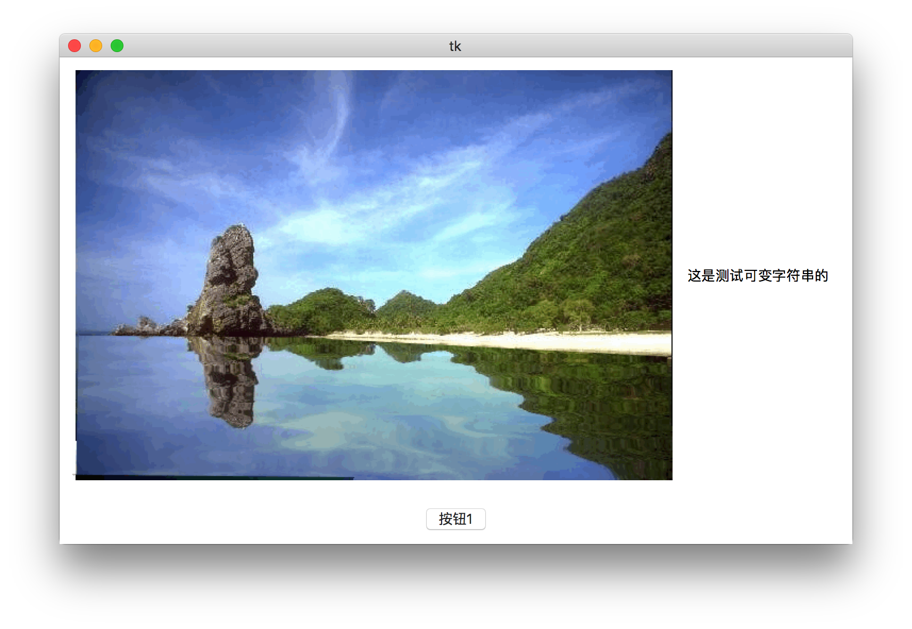
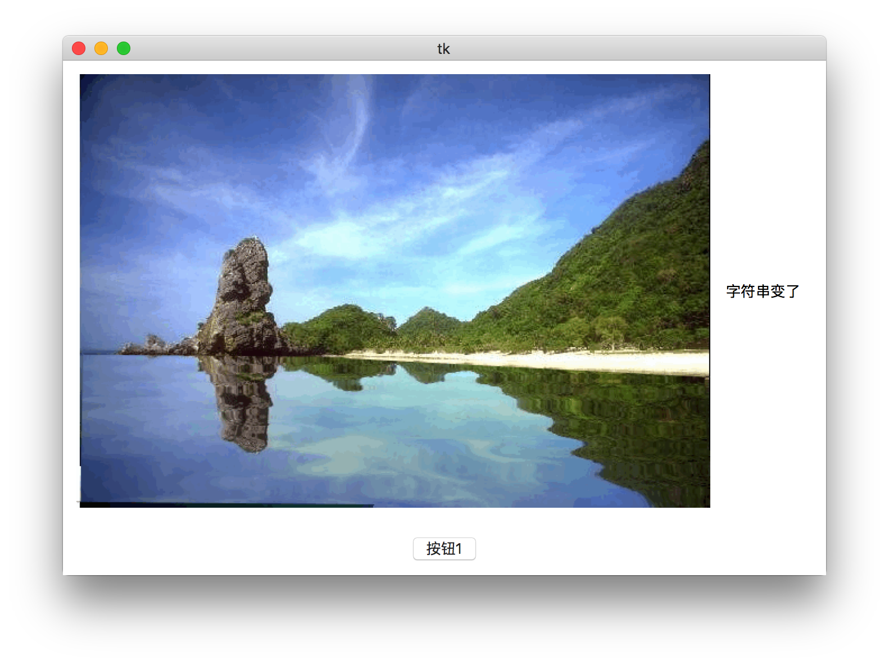
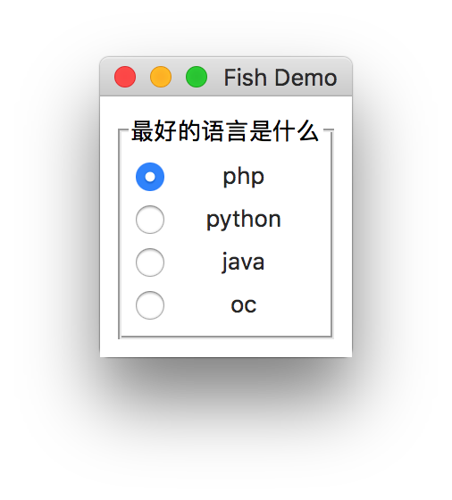

[TOC]


> [官方文档](https://docs.python.org/3.6/library/tkinter.html)
[中文参考文档](https://morvanzhou.github.io/tutorials/python-basic/tkinter/)
---


## 选项属性
```python
activebackground, activeforeground	-颜色
#当按钮被激活时所使用的颜色。

ancho	-按钮内容位置
#控制按钮上内容的位置。使用N, NE, E, SE, S, SW, W, NW, or CENTER这些值之一。默认值是CENTER。

background (bg), foreground (fg)
#按钮的颜色。默认值与特定平台相关。

bitmap	-位图

#显示在窗口部件中的特定图标(位图)。如果image选项被指定了，则这个选项被忽略。下面的位图在所有平台上都有 效：error, gray75, gray50, gray25, gray12, hourglass, info, questhead, question, 和 warning.
#仅在Macintosh上有 效：document, stationery, edition, application, accessory, folder, pfolder, trash, floppy, ramdisk, cdrom, preferences, querydoc, stop, note, 和 caution.
#你也可以从一个XBM文件中装载位图。只需要在XBM文件名前加一个前缀@,例如"@sample.xbm"。

borderwidth (bd)	-按钮边框长
#按钮边框的宽度。默认值与特定平台相关。但通常是1或2象素。

command	-回调
#当按钮被按下时所调用的一个函数或方法。所回调的可以是一个函数、方法或别的可调用的Python对象。

cursor	-光标
#当鼠标移动到按钮上时所显示的光标。

default	-常量
#如果设置了，则按钮为默认按钮。注意这个语法在Tk 8.0b2中已改变。

disabledforeground -按钮无效时颜色
#当按钮无效时的颜色。

font	-字体
# font=(‘字体名’,20)
#按钮所使用的字体。按钮只能包含一种字体的文本。

highlightbackground, highlightcolor	-控制焦点所在的高亮边框的颜色
#控制焦点所在的高亮边框的颜色。当窗口部件获得焦点的时候，边框为highlightcolor所指定的颜色。否则边框为highlightbackground所指定的颜色。默认值由系统所定。

highlightthickness	-控制焦点所在的高亮边框的宽度
#控制焦点所在的高亮边框的宽度。默认值通常是1或2象素。

image	-部件中显示的图象
#在部件中显示的图象。如果指定，则text和bitmap选项将被忽略。

justify	-多行文本如何对齐
#定义多行文本如何对齐。可取值有：LEFT, RIGHT, 或 CENTER。

padx, pady	-指定文本或图象与按钮边框的间距

#padx-x轴,pady-y轴指定文本或图象与按钮边框的间距。

relief	-边框的装饰
#边框的装饰。通常按钮按下时是凹陷的，否则凸起。另外的可能取值有GROOVE, RIDGE, 和 FLAT。

state	-按钮的状态
#按钮的状态：NORMAL, ACTIVE 或 DISABLED。默认值为NORMAL。

takefocus	-可以Tab键来将焦点移到这个按钮上
#表明用户可以Tab键来将焦点移到这个按钮上。默认值是一个空字符串，意思是如果按钮有按键绑定的话，它可以通过所绑定的按键来获得焦点。

text	-字符串内容
#显示在按钮中的文本。文本可以是多行。如果bitmaps或image选项被使用，则text选项被忽略。

textvariable		-可变内容
#与按钮相关的Tk变量（通常是一个字符串变量）。如果这个变量的值改变，那么按钮上的文本相应更新。

underline
#在文本标签中哪个字符加下划线。默认值为-1，意思是没有字符加下划线。

width, height	-按钮的尺寸
#按钮的尺寸。如果按钮显示文本，尺寸使用文本的单位。如果按钮显示图象，尺寸以象素为单位（或屏幕的单位）。如果尺寸没指定，它将根据按钮的内容来计算。

wraplength
#确定一个按钮的文本何时调整为多行。它以屏幕的单位为单位。默认不调整。

compound
# tk.Label(app,image=img,text='ceshiziti',compound=tk.CENTER)
#复合属性,可同时显示文字和图片,且文字位置可以调整
```


## 组件的三种调用
```
import tkinter as tk

window = tk.Tk()
window.title("窗口标题-demo")
window.geometry('200x100')

def demo():
    print("测试出发效果")

# 方法一
twoButton = tk.Button(window, text='测试按钮2', command=demo)
twoButton.pack()

# 方法二
oneButton = tk.Button(window)  # 通过查看源码可查看Button的标准参数和特定参数
oneButton['text'] = '测试按钮'
oneButton['command'] = demo
oneButton.pack()


# 方法三 类
class ThreeButton(object):
    def __init__(self, window):
        self.window = window
        self.create_button()

    def create_button(self):
        self.treeButton = tk.Button(self.window)
        # self.threeButton=tk.Button(self)  #或直接输入slef 即可
        self.treeButton['text'] = '测试按钮三'
        self.treeButton['command'] = self.treeDemo
        self.treeButton.pack()

    def treeDemo(self):
        print("测试按钮三")


ThreeButton(window)  # 实例化

window.mainloop()
```

## Frame子框架,lable中导入图片,可变字符串
```
import tkinter as tk

def callback():
    varString.set('字符串变了')

app = tk.Tk()  # 根窗口

#建立两个子框架
frame1 = tk.Frame(app)
frame2 = tk.Frame(app)

# 在lable中导入图片,格式只有gif
img = tk.PhotoImage(file='5.gif')
textLable = tk.Label(frame1, image=img)
textLable.pack(side=tk.LEFT)

# 设置可变字符串
varString = tk.StringVar()
varString.set("这是测试可变字符串的")

demoLabe = tk.Label(frame1, textvariable=varString, padx=10)
demoLabe.pack(side=tk.LEFT)

# 	添加回调函数,不要括号,加括号则未点击就触发一次
button1 = tk.Button(frame2, text='按钮1', command=callback) 
button1.pack()

#子框架打包
frame1.pack(padx=10, pady=10)
frame2.pack(padx=10, pady=10)

app.mainloop()

```



## Checkbutton 组件
```
varInt = tk.IntVar() #初始化一个整数变量
#variable 值选中切为1,取消且为0

check = tk.Checkbutton(app, text='hello word',variable=varInt)
check.pack()

lable = tk.Label(app, textvariable=varInt) 
lable.pack()
```
## Radiobutton 组件
```
import tkinter as tk

app = tk.Tk()
app.title("Fish Demo")  # 窗口标题
group = tk.LabelFrame(app, text='最好的语言是什么', padx=5, pady=5)
group.pack(padx=10, pady=10)

langs = [
    ('php', 2),
    ('python', 3),
    ('java', 4),
    ('oc', 5),
]

v = tk.IntVar()
v.set(2)  # 设置默认值为php
for lang, num in langs:
    b = tk.Radiobutton(group, text=lang, value=num, variable=v, indicatoron=tk.FALSE)
    b.pack(fill='x')

app.mainloop()
```


## Entry组件
```
import tkinter as tk

app = tk.Tk()
app.title("Fish Demo")  # 窗口标题

enter = tk.Entry(app)
enter.delete(0, tk.END)  # 先清空输入框内容
enter.insert(0, "请输入内容")  # 0表示从第几个字符插入内容
enter.pack(padx=20, pady=20)
app.mainloop()
```