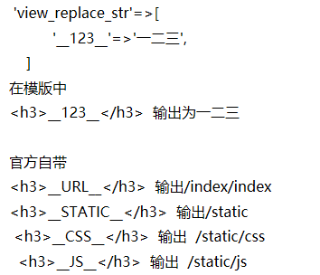

[TOC]

## 技巧
>自带.htaccess  无效

修改为: `			RewriteRule ^(.*)$ index.php/$1 [QSA,PT,L]  -->  RewriteRule ^(.*)$ index.php?/$1 [QSA,PT,L]`

>入口文件绑定
```
define('BIND_MODULE','admin');	
define('BIND_CONTROLLER','Index');
define('BIND_ACTION','index');
```

>创建新的入口文件
```php
//把index.php 内如复制到api.php
//浏览器访问 http://www.xxx.com/api.php
define('BIND_MODULE','api');  // -->api.php 只能访问api模块
define('BIND_MODULE','api/index'); 
```

>控制器输出

return 可以代替echo 输出 推荐使用return 输出

>事务回滚函数
```php
try{
    $db=Db::name('test');
    $arr=[
        "INSERT`dp_test`(`username`,`password`,`inttes`)VALUE('cpjinsert','passwor','1123')",
        "update`dp_test`set`username`='cpjupdate34'WHERE`id`=1",
    ];
    $res=$db->batchQuery($arr);
}catch(\Exception$e){
    dump($e->getMessage());
}
```
>获取当前模块,控制器,操作
```php
dump($request->module());		//  获取当前模块
dump($request->controller());		// 获取控制器名
dump($request->action());		//   获取当前操作名
```

>


## 安装
### git 安装
```
git clone --depth=1 https://github.com/top-think/think.git think_git
cd think_git
git clone --depth=1 https://github.com/top-think/framework.git thinkphp 
```
### composer 安装
```
composer create-project --prefer-dist topthink/think think_composer
```

## 配置
### 扩展配置
在`config/extra/email.php`,写入配置参数email会被当作建名.
```php
//例子:  创建db.php
config/extra/databases.php
    return array(
        //code
);
```
### 场景配置
在`config/extra/config.php` 或 `app`中 的`config.php`中
配置  `'app_status'             => 'office'`,
创建`config/extra/office.php`   和`config/extra/home.php`
调节`app_status`的值`office`或`home`的参数.选择不同配置.
在不同场景下 databases 的设置不同

## 路由
**在新建的config/config.php中开启路由**
```
// 是否开启路由
'url_route_on'           => true,
// 是否强制使用路由
'url_route_must'         => false,
```

**在新建config/route.php**
```php
//route.php
    return array(
    'news/:id/:age' =>'index/index/demo',  
);
//控制器中
public function demo($id,$age)
{
    return "id:{$id} age:{$age} ";
}
//访问地址
http://www.tp5.com/news/5/10
//生成url
在配置了路由规则后
echo url('index/index/demo',['id'=>5,'age'=>10]);  //news/5.html
```
## 视图
### 模版位置
默认路径,在index模块下
```
view/index/index.html
return  view();
```
### 四种赋值总结
```php
1. $this->assign('key', 'value');
2. $this->view-> keyname = 'value';
3. return $this->fetch('html模板名', [
       'key'   => 'value',
       'key2' => 'value2'
]);
4. View::share('key', 'value'); # 使用该方法必须先 use think\View;
```

### 配置文件

