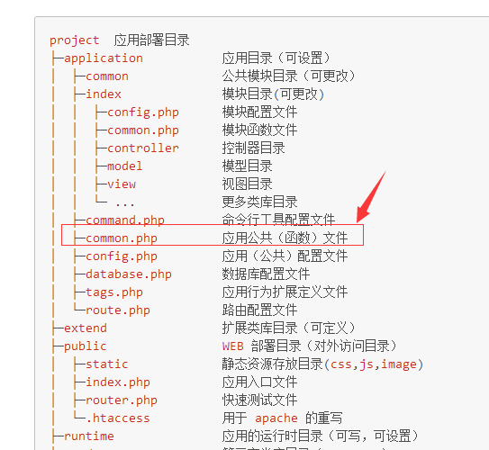

[TOC]

## 技巧
>自带.htaccess  无效
```
`RewriteRule ^(.*)$ index.php/$1 [QSA,PT,L]  
修改为
RewriteRule ^(.*)$ index.php?/$1 [QSA,PT,L]`
```

### Nginx 无法识别url
> [参考url](http://www.sou-xun.com/show/1395199.html)
```
location / {
            index  index.html index.htm index.php;
            #autoindex  on;
            
            # 加入此行代码
          if (!-e $request_filename) {
            rewrite  ^(.*)$  /index.php?s=/$1  last;
            break;
          }
        }
```


### 获取请求中的数据  (类 name="id[]" form元素)
```
$this->request->post('tid/a');
```

###  闭包(在闭包中传值)  且模型中用静态方法
```php
public static function getLoan($where=array(),$page=0,$sizePage=10,$order=''){
    $list  = LoanModel::all(function($query) use($where,$page,$sizePage,$order){
        $query->where($where)->page($page,$sizePage)->field('id,name,img,min_money,max_money,loan_rate,tip');
        if(!empty($order)){
            $query->order($order);
        }

    });
}
```
### 自定义不存在的字段
```
//$data 为该条记录数组
public function getLoanRateAttr($value,$data){
		$loan = LoanModel::get($data['id']);
		$value = "参考".$loan['time_type']."利率:  ".strval($value)."%";
		return  $value;
}
```


### 获取原始数据
```php
$user = User::get(1);
// 获取原始字段数据
echo $user->getData('status');
// 获取全部原始数据
dump($user->getData());
```

### 查询某条记录的某个值  
```
//使用 ->value
$loanTypeId = LoanTypeModel::where(['name' => $loanTypeId])->value('id');
//返回  字符串 3
//如果是colunm  则是对多条记录返回值
```

### 带条件分页
```
$loanData = LoanModel::where($where)->paginate(10,false,[
    'query'=>$this->request->param(),
]);
```

### 插入前检查字段名

```
fields_strict'  => true, //检查字段名

//异常可以用异常捕获
try{
    OrderModel::create($saveData);
} catch(\Exception $e){
    show($e->getMessage(),10004);
}
```
### 追加关联数组(紧接在数组后)
```
//只是针对 单条记录
$order = OrderModel::get(1)->appendRelationAttr('loan', 'max_money,min_money');

```
### 在模版中关联表中字段
```

//关联member表
public function member(){
    return $this->hasOne('MemberModel','uid','uid')->bind(['username'=>'name']);
}

<volist name="list" id="vo">
        <!--输出member表中姓名-->
        <td>{$vo.member.name}</td>
</volist>
```


### 目录结构



## 安装
### git 安装
```
git clone --depth=1 https://github.com/top-think/think.git think_git
cd think_git
git clone --depth=1 https://github.com/top-think/framework.git thinkphp 
```
### composer 安装
```
composer create-project --prefer-dist topthink/think think_composer
```

## 配置
### 扩展配置
在`config/extra/email.php`,写入配置参数email会被当作建名.
```php
//例子:  创建db.php
config/extra/databases.php
    return array(
        //code
);
```
### 场景配置
在`config/extra/config.php` 或 `app`中 的`config.php`中
配置  `'app_status'             => 'office'`,
创建`config/extra/office.php`   和`config/extra/home.php`
调节`app_status`的值`office`或`home`的参数.选择不同配置.
在不同场景下 databases 的设置不同


## 视图

### 配置文件
```php
'view_replace_str'=>[
    '__123__'=>'一二三',
]

#在模版中
<h3>__123__</h3>  			#输出为一二三
```
```php
#官方自带
<h3>__URL__</h3>  			#输出/index/index
<h3>__STATIC__</h3> 	    #输出/static
<h3>__CSS__</h3>  			#输出  /static/css
<h3>__JS__</h3>  			#输出  /static/js
```

## 静态增删改查操作

### 增
```
$user = User::create([
    'name'  =>  'thinkphp',
    'email' =>  'thinkphp@qq.com'
]);
echo $user->email;
echo $user->id; // 获取自增ID
```
### 删
#### 根据主键删除
```
User::destroy(1);
//或
User::destroy([1,2,3]);
```
#### 条件删除
```
User::destroy(['status' => 0]);
//或
User::where('id','>',10)->delete();
```

### 改

#### 查找并更新 
```
$user = User::get(1);
$user->name     = 'thinkphp';
$user->save();
```

#### 直接更新数据
```
User::update(['id' => 1, 'name' => 'thinkphp']);
```
#### 复杂界面更新
```
User::where(['status'=>1,'name'=>'cpj'])->update(['name' => 'thinkphp']);
```

#### 更新个别字段
```
$loan = LoanModel::get($id);
$loan->show_app = $loan->getData('show_app')==1?0:1;
$loan->save();
```

### 查
#### 获取单个数据
```
$user = User::get(1);
echo $user->name;

// 使用数组查询
$user = User::get(['name' => 'thinkphp']);

// 使用闭包查询
$user = User::get(function($query){
    $query->where('name', 'thinkphp');
});
echo $user->name;

// 获取某个列的所有值
User::where('status',1)->column('name')

// 以id为索引
User::where('status',1)->column('name','id');


```


#### 获取多个数据
```
// 或者使用数组
$list = User::all([1,2,3]);

// 使用条件查询(只能对where操作)
$list = User::all(['status'=>1]);

//闭包 比条件查找强大
$list = User::all(function($query){
    $query->where('status', 1)->limit(3)->order('id', 'asc');
});
```

### 一对一关联
#### 隐藏关联的数组,绑定父元素 加别名
```
//模型中方法,注意使用return进行
public function Reloan(){
    //外键id  reloanModel 的外键id
    return $this->hasOne('ReloanModel','lid')->bind('tid');  //->bind('username'=>'name')  把name改为username
}
//调用
LoanModel::get(8,'reloan')->hidden(['reloan'])     //hidden 先用bind绑定到父类 然后用hidden 隐藏关联表
LoanModel::all(8,'reloan')->hidden(['reloan','users'])
```

####  更新关联表
```
$loan = LoanModel::get(8);
$loan->reloan->tid=12;
$loan->reloan->save();
```

## thinkcmf 5.0 技巧

#### 文件上传
```
//配置文件位置

cmf 上传设置可在后台进行设置

//admin.js 包含封装的js

//应用
<a href="javascript:uploadOne('apk上传','#thumb','file');" class="btn btn-sm btn-default">选择文件</a>

```
## 模板布局 layout

1. 开启 layout
```
'template'  =>  [
    'layout_on'     =>  true,
    'layout_name' => 'layout',
    'layout_item' => '{__CONTENT__}',
]
```
2. view 的根目录建立layout.html 文件,并写入一下内容
```
{include file="public/header" /}
 {__CONTENT__}
{include file="public/footer" /}
```
3. 在view 的其他目录中只需要写相关信息  不需要在用include 引入head头和fllter


## 模型验证 validate
### 独立验证
```
$data     = [
    'email' => 'thinkphp@qq.com',
];
$validata = [
    'name|姓名'  => 'require|max:25',
    'email|邮箱' => 'email',
];
$result   = $this->validate($data, $validata);
if(true !== $result){
    // 验证失败 输出错误信息
    dump($result);//姓名不能为空
}
```
### 建立公共validata 方便参数认证

在app/common/param中 简历 验证器
```
$data     = [
    'email' => 'thinkphp@qq.com',
];

$result =$this->validate($data,'param.vali_user');
if(true!==$result){
    halt($result);//用户名必须
}
```

## 操作连个数据库
把其中一个模块选为第二个数据库 
在模块中创建一个基本模型`base.php`  设置model参数为
```
 protected $connection=[
	    // 服务器地址
	    'hostname'        => 'localhost',
	    // 数据库名
	    'database'        => 'xsfenxiao',
	    // 用户名
	    'username'        => 'root',
	    // 密码
	    'password'        => 'root',
	    // 端口
	    'hostport'        => '3306',
	    // 数据库表前缀
	    'prefix'          => 'vv_',
    ];
    
```