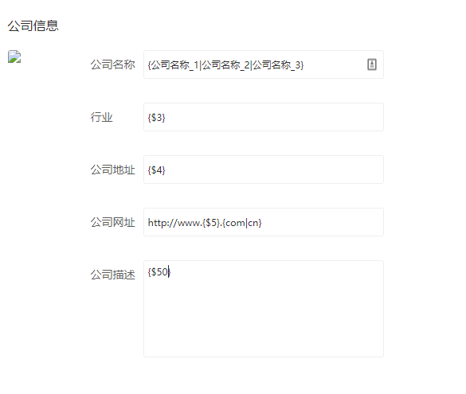
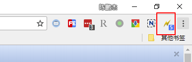

[TOC]

## 填充规则

1. `{field|reference}` 	 随机选择
如: `{公司名称_1|公司名称_2|公司名称_3}`

2. `{number++}`/`{number--}`   自增/自减
如:`{9+}` 第一次为9 第二次为10

3. `{#}`  小数位数
如: `{#3}` 表示三位小数

4. `{$}`  随机字符串
如 :`{$6} ` 随机6位字符串

## 快速添加对应的规则

1. 网页中写入规则
2. 点击插件创建或更新规则

--

## 常用字段
1. 网址
`{http|https}://www.{$5}.{com|cn}`
