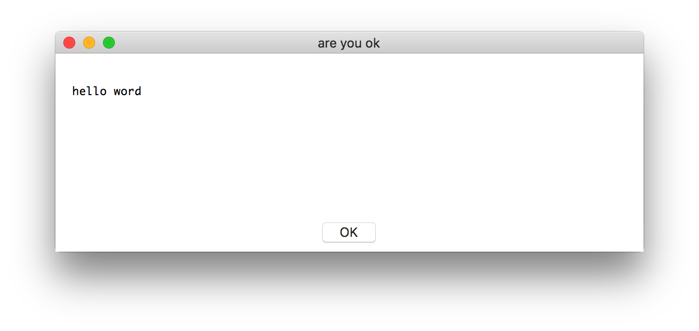
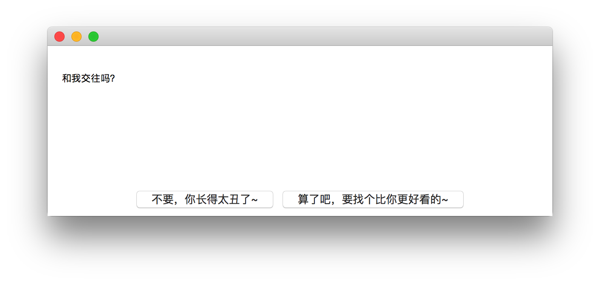
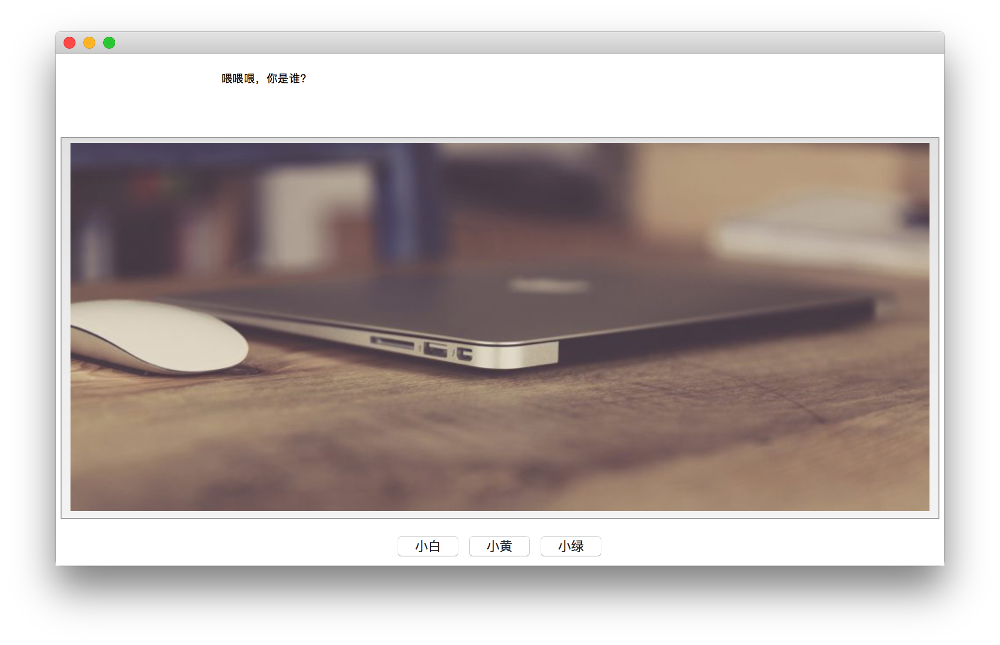
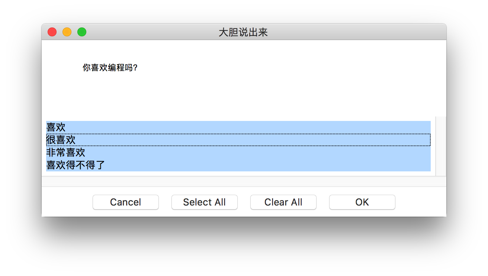
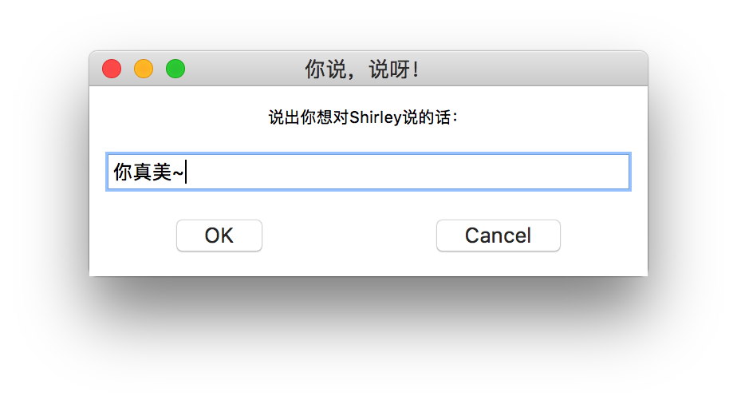
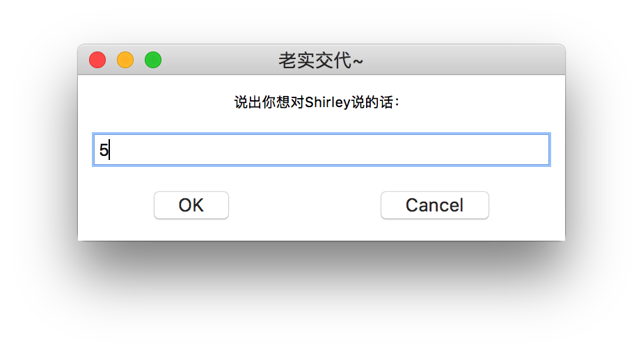
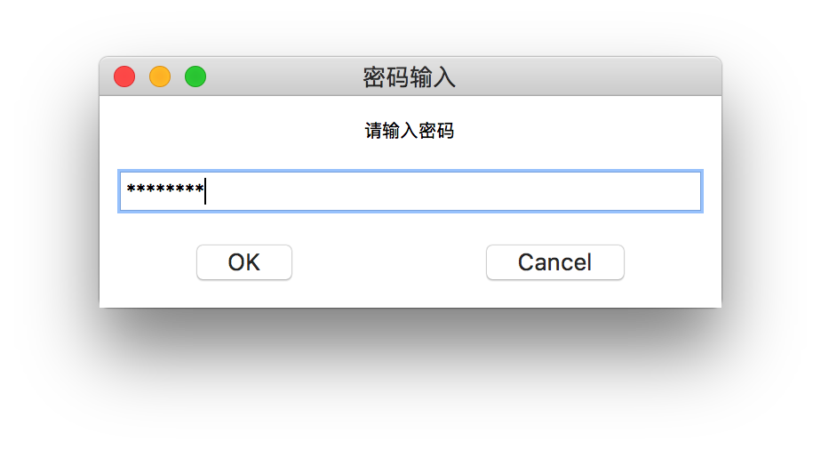
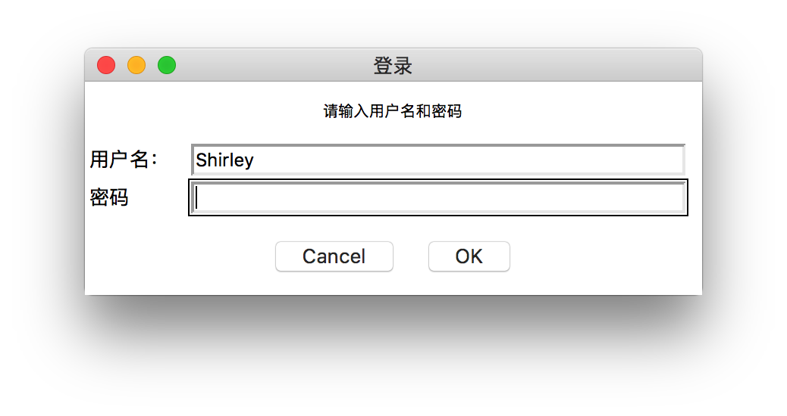
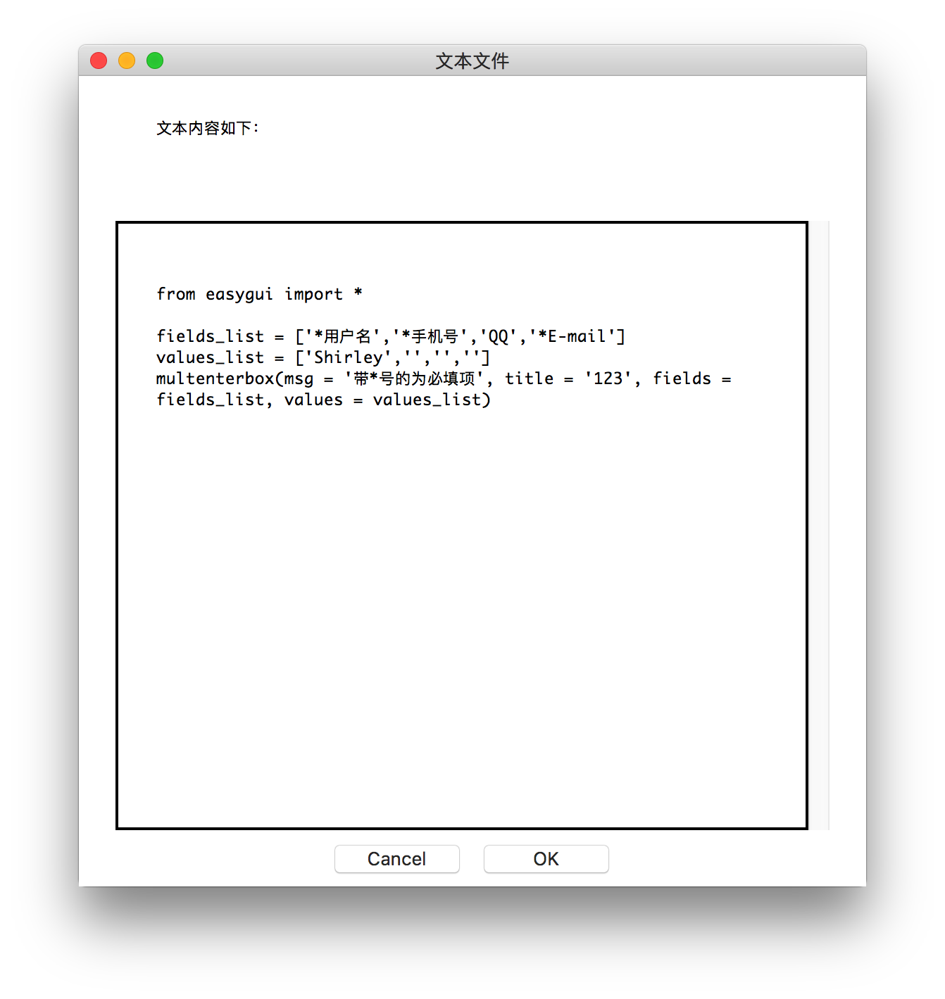
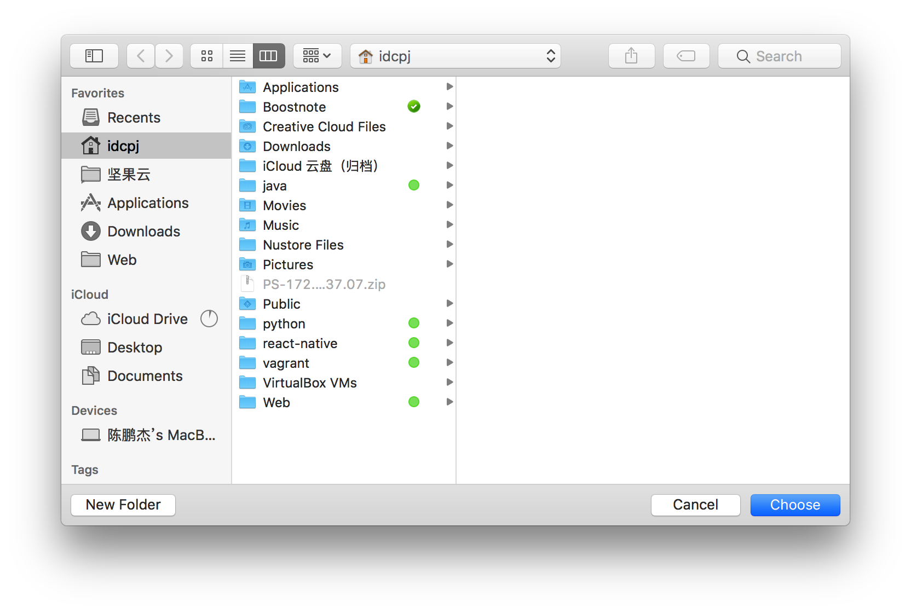

[TOC]

---
> [英文参考文档](http://easygui.sourceforge.net/)

## 安装
`pip3 install easygui`

## 三种导入方式
1. 方法1
```
import easygui
easygui.msgbox(...)
```
2. 方法2
```
from easygui import *
msgbox(...)
```
3. 方法3
```
import easygui as g
g.msgbox(...)
```

## 确认框/选择框

### msgbox 提示框
```python
msgbox(msg = '', title = '', ok_button = 'OK', image = None, root = None)

msgbox （“备份完成！” ， ok_button = “干得好！” ）
```


### choicebox列表框
```
from easygui import *
choices = ['喜欢','很喜欢','非常喜欢']
reply = choicebox('你喜欢我吗？', choices = choices)
```


### ccbox确认框 (ynbox() 作用相同)
```python
ccbox(msg = 'continue?', title = '', choices = ('choice1', 'choice2'), image = None)
#注意：ccbox()是返回整型的1或0，不是布尔型的True或False。
```
demo
```

if ccbox('和我交往吗？', choices = ('不要，你长得太丑了~','算了吧，要找个比你更好看的~')):
    msgbox('那我们绝交吧！哼~')
else:
    sys.exit(0)
```


### buttonbox
```
a =g.buttonbox(msg = '你叫什么名字？', choices = ('小花', '小芳', '小明'))
g.msgbox(a) #小芳
```


### indexbox 和 boolbox
`indexbox`比`buttonbox`，区别为选择第一个按钮时返回序号0，选择第二个返回1.
`boolbox`比`buttonbox`，区别为选择第一个按钮时返回序号1，选择第二个返回0.  

### multchoicebox  列表值对选
```
choices = ['喜欢','很喜欢','非常喜欢', '喜欢得不得了']
a = g.multchoicebox(msg = '你喜欢编程吗？', title = '大胆说出来', choices = choices)
g.msgbox(a) #喜欢 非常喜欢
```


##  用户输入

### enterbox  用户输入字符串
```
a = g.enterbox(msg = '说出你想对Shirley说的话：',title = '你说，说呀！',default = '你真美~',strip = None)
g.msgbox(a) #输入的内容
```
返回值为用户输入的字符串。默认返回值会去首尾空格，strip=False设置后可保留空格，参数default为输入框默认显示值。



### integerbox  输入规定范围的整数
```
integerbox(msg = '说出你想对Shirley说的话：',title = '老实交代~',default = 5 ,lowerbound = 0, upperbound=5,root=None)
```
lowerbound参数设置最小值，upperbound参数设置最大值的整型数值 ，否则会要求用户重新输入。输入的为int型。


### multenterbox  多个输入框
```
fields_list = ['*用户名','*手机号','QQ','*E-mail']
values_list = ['Shirley','','','']
multenterbox(msg = '带*号的为必填项', title = '123', fields = fields_list, values = values_list)
```
1. 如果用户输入的值比选项少，则返回列表中的值用空字符串填充用户为输入的选项；
2. 如果用户输入的值比选项多，则返回列表中的值将截断为选项的数量；
3. 如果用户取消操作，则返回域中的列表的值或者None值；


### passwordbox 密码输入框

```
passwordbox(msg = '请输入密码', title = '密码输入')
```


### multpasswordbox 用户名密码输入框
```
g.multpasswordbox(msg = '请输入用户名和密码', title = '登录',fields = ('用户名：','密码'), values = ('Shirley',))
```
如果多与两个选项，则最后一个为密码的输入框



## 显示文本

### textbox 文本现实框
```
text = """
从明天起，做一个幸福的人
愿你在尘世获得幸福
我只愿面朝大海，春暖花开
"""

textbox(msg = '文本内容如下：', title = '文本文件', text = text, codebox = 1)
```
函数默认会以比例字体（参数codebox = 1设置为等宽字体）来显示文本内容（会自动换行），参数text可以是字符串类型，列表类型，或者元组类型。


### codebox 等框显示文本
`codebox(msg = '', title = '', text = '')`
相当于`textbox(codebox=1)`

## 目录与文件
当需要用户输入目录及文件名的时候，需要有浏览文件系统，让用户选择

### diropenbox 选择目录
`diropenbox(msg = '请选择文件：',title = '浏览文件',default = None)`
用于提供一个对话框，返回用户选择的目录名（完整路径),`default`为默认路径


### fileopenbox 选择文件
```
filetypes = ["*.php","*.py"]
a = fileopenbox(msg = '请选择文件：',title = '浏览文件',filetypes=filetypes)
```
返回文件路径

### filesavebox 文件需要保存的位置
```
a = filesavebox(msg="choince your path",title='path',default="test.txt")
```
default:默认需要保存的位置


