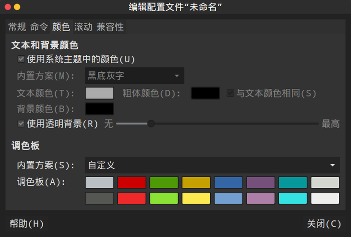

[TOC]

## 使用前准备
1. 更换源
```
sudo vim /etc/apt/sources.list   

#在文件开头添加下面的阿里云的软件源：
deb http://mirrors.aliyun.com/ubuntu/ quantal main restricted universe multiverse  
deb http://mirrors.aliyun.com/ubuntu/ quantal-security main restricted universe multiverse  
deb http://mirrors.aliyun.com/ubuntu/ quantal-updates main restricted universe multiverse  
deb http://mirrors.aliyun.com/ubuntu/ quantal-proposed main restricted universe multiverse  
deb http://mirrors.aliyun.com/ubuntu/ quantal-backports main restricted universe multiverse  
deb-src http://mirrors.aliyun.com/ubuntu/ quantal main restricted universe multiverse  
deb-src http://mirrors.aliyun.com/ubuntu/ quantal-security main restricted universe multiverse  
deb-src http://mirrors.aliyun.com/ubuntu/ quantal-updates main restricted universe multiverse  
deb-src http://mirrors.aliyun.com/ubuntu/ quantal-proposed main restricted universe multiverse  
deb-src http://mirrors.aliyun.com/ubuntu/ quantal-backports main restricted universe multiverse  
```
3. 安装宝塔山
4. 安装google浏览器
```
sudo wget http://www.linuxidc.com/files/repo/google-chrome.list -P /etc/apt/sources.list.d/
wget -q -O - https://dl.google.com/linux/linux_signing_key.pub  | sudo apt-key add -
sudo apt-get update
sudo apt-get install google-chrome-stable
```
3. 安装影梭
	安装qt5版本
    ```
    sudo add-apt-repository ppa:hzwhuang/ss-qt5
    sudo apt-get update
    sudo apt-get install shadowsocks-qt5
    ```
    安装命令行版
    ```
    apt-get install python-pip       //安装pippython-pip环境
    pip install shadowsocks        //安装ss
    vim /etc/shadowsocks.json        //打开ss配置文件
    {
    “server”:”0.0.0.0″,                         #ec2使用的是NAT，不能填公网ip，而应该用0.0.0.0
    “server_port”:端口,                        
    “password”:”连接密码”,                 
    “timeout”:300,
    “method”:”aes-256-cfb”,
    “fast_open”: false
    }
    ssserver -c /etc/shadowsocks.json -d start           //启动ss
    ```
4. SwitchyOmega配置
	[参考网站](https://blog.csdn.net/u013401853/article/details/72997524) 
    
    
## 美化
1. 安装主题 - flatabulous-theme 
```
sudo add-apt-repository ppa:noobslab/themes
sudo apt-get update
sudo apt-get install flatabulous-theme
```
2. 图标 -  ultra-flat-icons
```
sudo add-apt-repository ppa:noobslab/icons
sudo apt-get update
sudo apt-get install ultra-flat-icons
```
3. 指针  - macbuntu-os-ithemes-lts-v7
```
sudo add-apt-repository ppa:noobslab/macbuntu
sudo apt-get update
sudo apt-get install macbuntu-os-icons-lts-v7
sudo apt-get install macbuntu-os-ithemes-lts-v7
```
4. 字体
`sudo apt-get install fonts-wqy-microhei`
5. 运用和设置 - unity-tweak-tool
`sudo apt-get install unity-tweak-tool`
6. 设置开机自启 - gnome-tweak-tool
`sudo apt-get install gnome-tweak-tool`
7. 终端美化 - oh-my-zsh
```
sudo apt-get install zsh
sudo apt-get install git
sudo wget https://github.com/robbyrussell/oh-my-zsh/raw/master/tools/install.sh -O - | sh
chsh -s /bin/zsh
```
- 然后右键终端进入配置文件-配置文件首选项-颜色

- 设置终端主题
```
ll ~/.oh-my-zsh/themes/

vim ~/.zshrc  # 替换 themes 中的主题
```
8. dock 美化
`sudo apt-get install cairo-dock`

## 常用软件
1. 解压rar
`sudo apt-get install unrar`
2. 安装wps
[下载wps](http://community.wps.cn/download/)
```
sudo dpkg -i wps-office_10.1.0.5672~a21_amd64.deb
#同样，如果提示缺少依赖，运行一下命令
sudo apt-get -f install
再次安装。
```
3. 搜狗输入法
4. 