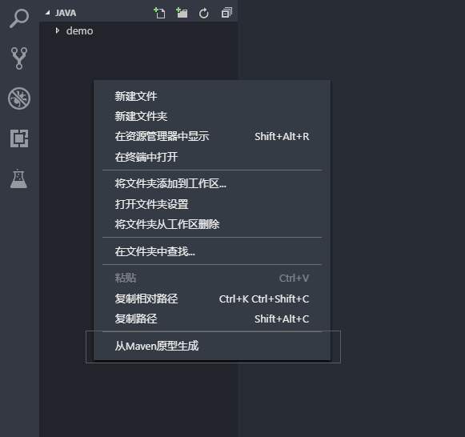

[TOC]

## 必备插件
```
Chinese (Simplified)   中文插件
IntelliJ IDEA Keybindings    键盘映射扩展
Settings Sync    同步设置到 gitgist
```
## 同步配置
[参考网站](https://tmr.js.org/p/fa3b8081/)
1. 下载插件
`Settings Sync
`
2. 上传配置
`Ctrl+Shift+p`-> `>sync 上传配置`
3. 下载配置
`Ctrl+Shift+p` ->`sync 下载配置`


## 安装java环境
1. `choco install java`
2. ` choco install maven`
3. 用maven 生成项目


## 配置python
1. 在编辑左下角可选择python的版本 
    或 `Ctrl+Shift+p` 搜索`Python: Select Interpreter`
2. 添加 debug 功能,在左端选择debug ,选择齿轮即可


## 配置git
搜搜git 插件安装 前几个 即可
```
Git History Diff
Git Patch
```
### 添加远程仓库
通过命令行的方式添加

### 查看当前文件的历史文件
1. 在当前文件右键,选择`GitHD : View FIle History`
2. 在弹出的页面选择历史commit 
3. 在左边列出来的文件的`Focus` 就是次文件的历史文件

###  导出(应用)补丁
1. 导出补丁
在分支选项中. 点击`...` 按钮,选择`Git:Createes a patch fron unstages files` 即可把 当前改动文件导出为一个补丁
2. 应用补丁
在同一地方点击`...` 选择`Git:Apply a patch from existing path file`
 


