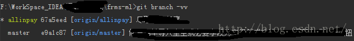

[TOC]

## 本地已有项目上传到 github
1. 在 github 上新建一个仓库
2. 输入以下代码
```
git init
git add README.md
git commit -m "first commit"
git remote add origin git@github.com:idcpj/test1.git
git push -u origin master
```

## 撤销 git add  某个文件操作
```
$ git status #查看添加到 git 的文件
$ git rm --cached <file>
```
## 撤销所有 gir add 操作
```
$ git status #查看添加到 git 的文件
$ git reset HEAD .
```

## 合并 某文件的冲突
如果文件在两个仓库中都被修改,且都在本地 git commit 了 .则 git pull 后需要手动同步,HEADR 为本地内容,有随机编码为线上版本
```
ha1211221haha
# test
<<<<<<< HEAD

{123
123123
}21312312
=======
{
    23123123
}
>>>>>>> fb44e678d30a4297009774f3018e2694ca319866
## test

 ```

## git diff --cache 查看缓存区与版本库的差别
需要把文件存入 git add 进入缓存区 和本地版本中文件进行比较

## 撤销更改
`git checkout README.md`

## 切换远程分支
```
git branch -a  //列出所有分支
    remotes/origin/dev
    remotes/origin/release
git checkout -b 本地分支名  origin/dev  //远程分支名
```
## 查看本地分支对应的 远程分支
```
git branch -vv
```
