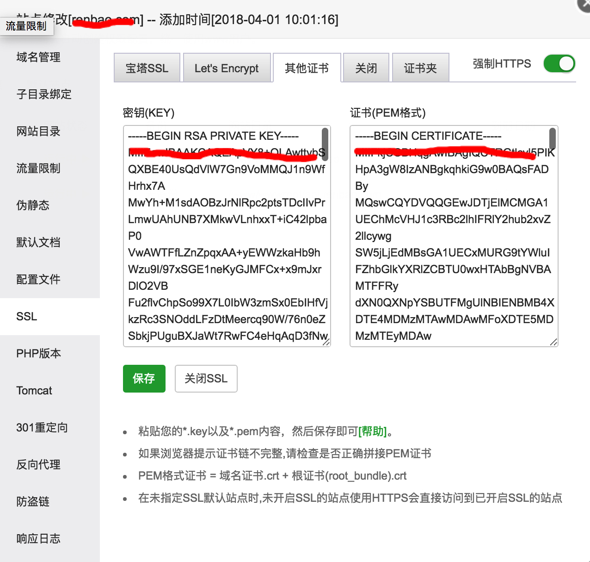

[TOC]

> [官网](http://www.bt.cn/download/linux.html)
> [看云手册](http://docs.bt.cn/424236)

## 安装 SSL 证书
如果你的证书是`test.com.cer、test.com_ca.crt、test.com.key` 三个文件.
1. 将cer文件内容复制到crt文件头部，保存改名为test.com.crt,中间不可用有空行
```
-----BEGIN CERTIFICATE-----
MIIFkjCCBHqgAwIBAgIQCTRGtlcvl5PIKHpA3gW8IzANBgkqhkiG9w0BAQsFADBy
more...
-----END CERTIFICATE-----
-----BEGIN CERTIFICATE-----
MIIErjCCA5agAwIBAgIQBYAmfwbylVM0jhwYWl7uLjANBgkqhkiG9w0BAQsFADBh
more..
-----END CERTIFICATE-----
```
2. 添加证书
key对应test.com.key 文件 ,pem可直接复制合并后到test.com.crt


