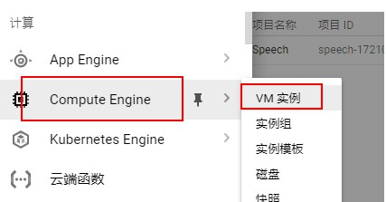
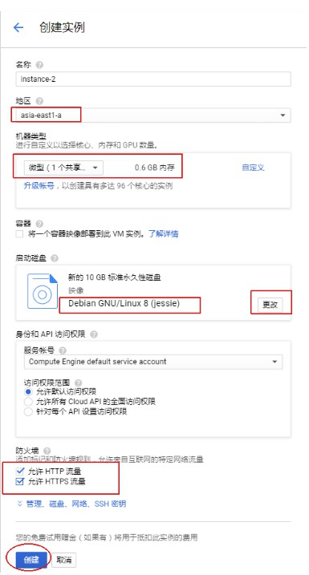
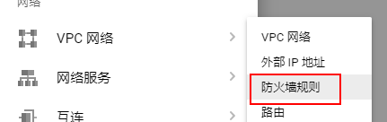
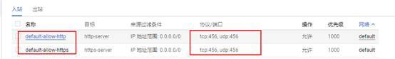

[TOC]

>参考网站[facebook](https://www.facebook.com/notes/%E6%93%81%E6%8A%B1%E5%A4%A7%E9%99%B8/%E5%88%A9%E7%94%A8%E8%B0%B7%E6%AD%8C%E4%BA%91%E5%B9%B3%E5%8F%B0googlecloudplatform%E6%90%AD%E5%BB%BAvps/1447411805367407/?fref=gs&dti=425337571137669&hc_location=group)


## 谷歌云
如果用[谷歌云](https://cloud.google.com/)申请了免费送的300$
在左上角设置中




##  测试
https://www.ipip.net/traceroute.php 网站测试生成的ip 测试是否在100以内

## 配置服务器
```
sudo –i

wget -N --no-check-certificate https://raw.githubusercontent.com/FunctionClub/YankeeBBR/master/bbr.sh && bash bbr.sh install
```
 蓝底窗⼝口 按tab键 选择NO,然后选择重启输入Y，点回车会重新连接SSH或者你关闭重新在进也是一样的

```
sudo -i 
bash bbr.sh start
wget --no-check-certificate https://raw.githubusercontent.com/teddysun/shadowsocks_install/master/shadowsocksR.sh&& chmod +x shadowsocksR.sh 

./shadowsocksR.sh

```
设置密码和端口

## 配置防火墙规则


**注意default-allow-http和default-allow-https 都需要点进去分别设置的**

## ssh 连接google 云
1. 首先设置密码
```
$ sudo passwd ${whoami} // 下面以 user 代替 ${whoami}
$ sudo passwd root
```
3. 本地通过私钥登录
[查看简书](https://www.jianshu.com/p/57e85cf3e50b)
2. 通过密码登录
因为google 把密码验证登录关了，需要自行打开
```bash
$ sudo vi /etc/ssh/sshd_config
PasswordAuthentication yes 
:wq!

# 改完要重启 ssh 服务
$ sudo service sshd restart
```