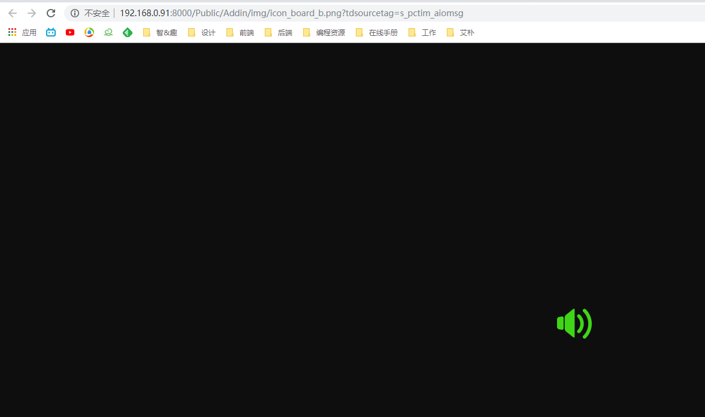

[TOC]

## 导入js
```
<script src="http://static.runoob.com/assets/jquery-validation-1.14.0/lib/jquery.js"></script>
<script src="http://static.runoob.com/assets/jquery-validation-1.14.0/dist/jquery.validate.min.js"></script>
```
## 默认校验规则.

|序号|规则|描述|
|---|---|---|
|1	|required:true	|必须输入的字段。|
|2	|remote:"check.php"	使|用 ajax 方法调用 check.php 验证输入值。|
|3	|email:true|	必须输入正确格式的电子邮件。|
|4	|url:true	|必须输入正确格式的网址。|
|5	|date:true	|必须输入正确格式的日期。日期校验 ie6 出错，慎用。|
|6	|dateISO:true|	必须输入正确格式的日期（ISO），例如：2009-06-23，1998/01/22。只验证格式，不验证有效性。|
|7	|number:true	|必须输入合法的数字（负数，小数）。|
|8	|digits:true	|必须输入整数。|
|10|	equalTo:"#field"	|输入值必须和 #field 相同。|
|11|	accept:	|输入拥有合法后缀名的字符串（上传文件的后缀）。|
|12|	maxlength:5	|输入长度最多是 5 的字符串（汉字算一个字符）。|
|13|	minlength:10	|输入长度最小是 10 的字符串（汉字算一个字符）。|
|14|	rangelength:[5,10]	|输入长度必须介于 5 和 10 之间的字符串（汉字算一个字符）。|
|15|	range:[5,10]	|输入值必须介于 5 和 10 之间。|
|16|	max:5	|输入值不能大于 5。|
|17|	min:10	|输入值不能小于 10。|
## 默认提示
 
validate 提供了默认提示
`<script src="http://static.runoob.com/assets/jquery-validation-1.14.0/dist/localization/messages_zh.js"></script>
`
## 使用方式
### 将校验规则写到控件中
```
$.validator.setDefaults({
    submitHandler: function(form) {
        //可自定义表单时间
    }
});
$().ready(function() {
    $("#commentForm").validate();
});
</script>
<form class="cmxform" id="commentForm" method="get" action="">
  <fieldset>
    <legend>输入您的名字，邮箱，URL，备注。</legend>
    <p>
      <label for="cname">Name (必需, 最小两个字母)</label>
      <input id="cname" name="name" minlength="2" type="text" required>
    </p>
    <p>
      <input class="submit" type="submit" value="Submit">
    </p>
  </fieldset>
</form>
```
###  将校验规则写到 js 代码中
```
 $("#signupForm").validate({
    rules: {
      password: {
        required: true,
        minlength: 5
      },
      confirm_password: {
        required: true,
        minlength: 5,
        equalTo: "#password"
      },
      email: {
        required: true,
        email: true
      },
      topic: {
        required: "#newsletter:checked",
        minlength: 2
      },
    },
    messages: {
      username: {
        required: "请输入用户名",
        minlength: "用户名必需由两个字母组成"
      },
      password: {
        required: "请输入密码",
        minlength: "密码长度不能小于 5 个字母"
      },
      confirm_password: {
        required: "请输入密码",
        minlength: "密码长度不能小于 5 个字母",
        equalTo: "两次密码输入不一致"
      },
      agree: "请接受我们的声明",
      topic: "请选择两个主题"
     }
    })
});
```
##  设置提交方式
单独设置
```
$("#signupForm").validate({
        submitHandler:function(form){
            $(form).ajaxSubmit();  
            //form.submit();
        }    
    });
```
默认设置
```
$.validator.setDefaults({
  submitHandler: function(form) { form.submit(); }
});
```
## 更改错误信息显示的位置
```
var validator = $("#form1").validate({
    errorPlacement: function(error, element) {
        // Append error within linked label
        console.log(error);
        console.log(element);

        $( element )
            .closest( "form" )
            .find( "label[for='" + element.attr( "id" ) + "']" )
            .append( error );
    },
    errorElement: "span",
});
```
## 更改错误信息显示的样式
由于提示的错误消息格式相同

 `<label id="password-error" class="error" for="password"> (字母不能少于 5 个且不能大于 12 个)</label>`
可以通过设置 来设置样式
```
input.error {}
label.error{}
label.checked  {}
```
## 每个字段验证通过执行函数
```
success: function(label) {
    // set &nbsp; as text for IE
    label.html("&nbsp;").addClass("checked");
    //label.addClass("valid").text("Ok!")
}
```

## 添加自定义校验
```
// 邮政编码验证   
jQuery.validator.addMethod("isZipCode", function(value, element) {   
    var tel = /^[0-9]{6}$/;
    return this.optional(element) || (tel.test(value));
}, "请正确填写您的邮政编码");
```


