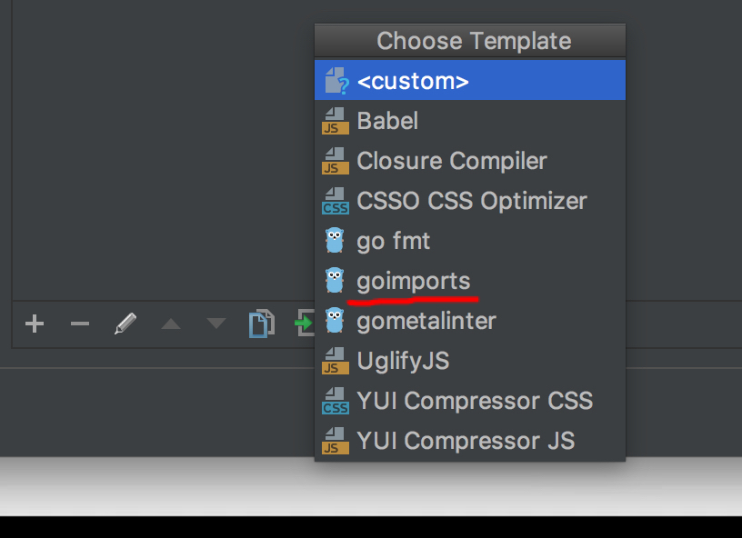
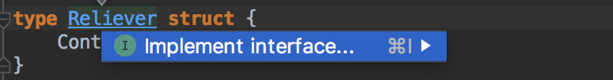

[TOC]

## 激活

`http://idea.youbbs.org`


## 配置 - 使运行时,自动过滤 多余的 import
下载
`go get golang.org/x/tools/cmd/goimports`
goland 打开配置选项

`go  -> no save  ->file watch跳转 -> 添加 -> 选中`


此时点击保存或运行时,就会自动过滤
 若没有效果 ,在`工具 -> gotool `中先运行一次 `goimport` 即可

## 其他
1. 在 `struct` 类型声明的名字上 按`alt + enter` 可以快速创建集成在 struct 的 接口
如:


## 快捷键
mac 
```
ctrl + p			查看 method 参数信息	
ctrl + shift + p	查看表达式类型
ctrl + alt + v		自动生成表达式返回值	
ctrl + shift + space	智能类型推断式返回
```

## 调试测试
若设置到读取本地文件的情况,则需要在调试设置中,指定输出的文件位置为当前项目下