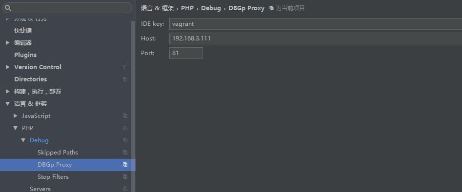
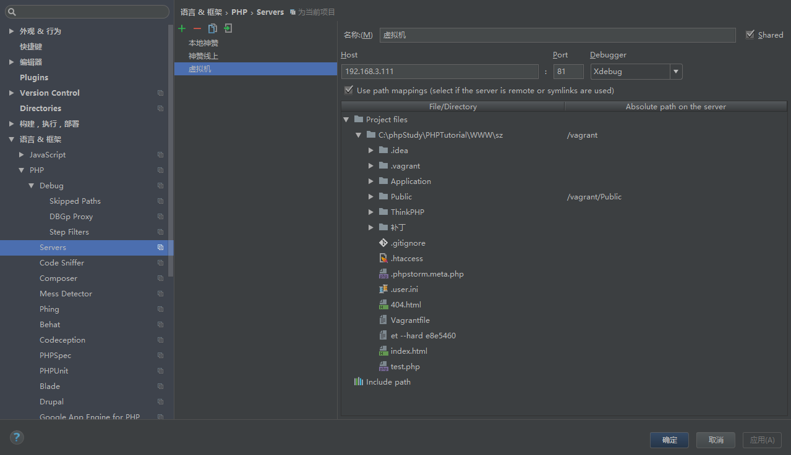

[TOC]

> [参看文档](https://segmentfault.com/a/1190000007789295)

## 安装xdebug

在php.ini中配置
```
zend_extension=xdebug.so

xdebug.idekey = "vagrant"
xdebug.default_enable = 1
xdebug.remote_connect_back = 1
xdebug.remote_port = 9000
xdebug.remote_enable = 1
xdebug.remote_autostart = 1
xdebug.remote_handler="dbgp"
```
 
 > **必须重启php**
 
## 配置xdebug 端口


## 设置DBGp Proxy



## 添加一个Server
注意需要配置Use Path



之后按照正常的debug 处理